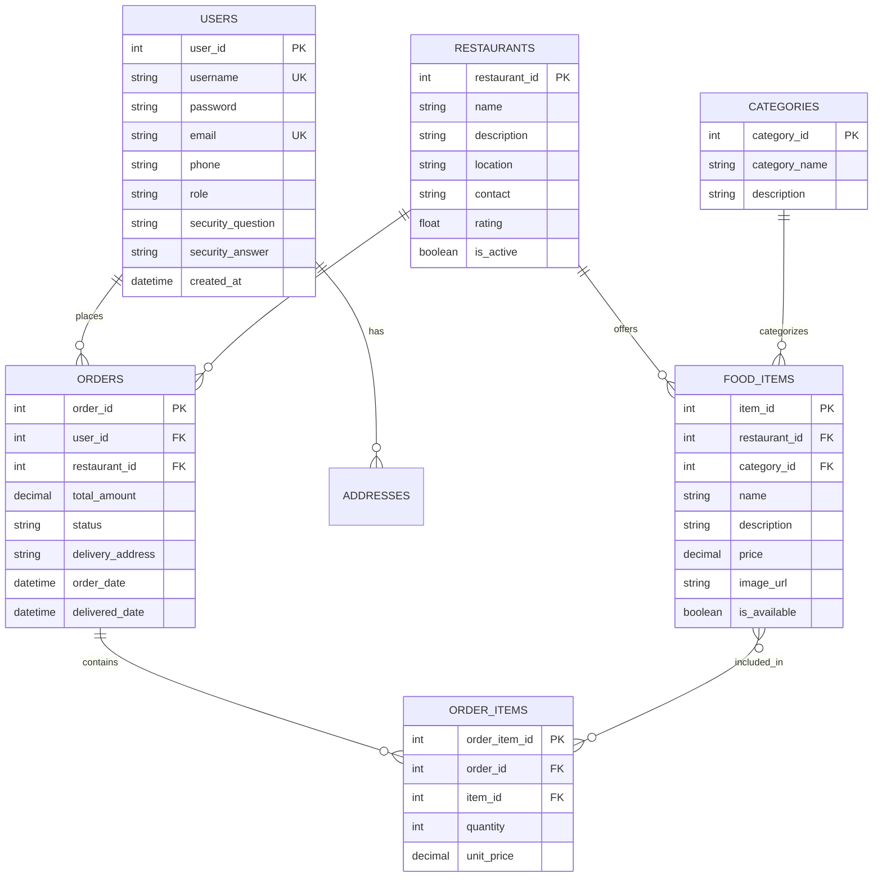

# 🍽️ Khuda Lagse: Online Food Delivery System

<div align="center">


**A comprehensive food delivery platform connecting customers with local restaurants - Built with Java Swing and MySQL**


</div>

## 📋 Table of Contents

- [Overview](#-overview)
- [Features](#-features)
- [Screenshots](#-screenshots)
- [System Architecture](#-system-architecture)
- [Database Design](#-database-design)
- [Installation Guide](#-installation-guide)
- [Usage Guide](#-usage-guide)
- [Project Structure](#-project-structure)
- [Technical Implementation](#-technical-implementation)
- [Academic Context](#-academic-context)
- [Team Members](#-team-members)
- [Future Enhancements](#-future-enhancements)
- [License](#-license)
- [Acknowledgments](#-acknowledgments)

## 🎯 Overview

**Khuda Lagse** (খুদা লাগছে - "Feeling Hungry" in Bengali) is a comprehensive desktop-based food delivery platform developed as part of the **Object-Oriented Design & Programming II (OODP-II)** course during the 2nd year, 1st semester. The application connects customers with local restaurants, providing a seamless food ordering and delivery experience.

### 🎓 Academic Project
- **Course**: OODP-II (Object-Oriented Design & Programming II)
- **Semester**: 2nd Year, 1st Semester
- **Team Size**: Group Project (3-4 members)
- **Technology**: Java Swing, MySQL, JDBC

### 🚀 Key Highlights
- **Complete Order Management**: From browsing to billing
- **Multi-Role System**: Customer, Restaurant, and Admin interfaces
- **PDF Invoice Generation**: Automatic bill generation for orders
- **Secure Authentication**: User registration with security questions
- **Real-time Order Tracking**: Order status updates for all parties

## ✨ Features

### 👥 Multi-Role Functionalities

#### **👤 Customer Features**
- **User Registration & Login**: Secure authentication system
- **Restaurant Browsing**: View available restaurants and menus
- **Interactive Food Selection**: Visual food item display with images
- **Shopping Cart**: Add/remove items with quantity adjustment
- **Order Placement**: Complete order process with delivery details
- **Order History**: View past orders with PDF invoices
- **Profile Management**: Update personal information and change password

#### **🏪 Restaurant/Vendor Features**
- **Menu Management**: Add, edit, or remove food items
- **Order Management**: View and process incoming orders
- **Order Status Updates**: Track preparation and delivery status
- **Sales Analytics**: View revenue and popular items
- **Inventory Management**: Track stock levels and availability

#### **👑 Admin/System Features**
- **User Verification**: Approve/disable user accounts
- **Category Management**: Add/edit food categories
- **Product Management**: Manage all food items across restaurants
- **Revenue Dashboard**: View total earnings and transaction history
- **Order Monitoring**: View all orders with filtering options
- **System Reports**: Generate sales and user activity reports

### 🛠️ Advanced Features
- **Dynamic Slideshow**: Rotating display of featured food items
- **Smart Search**: Filter restaurants and food items
- **PDF Invoice Generation**: Professional billing with itemized details
- **Data Export**: Export order history to CSV format
- **Password Recovery**: Security question-based password reset
- **Real-time Updates**: Live order status tracking
- **Input Validation**: Comprehensive form validation and error handling

## 📸 Screenshots

<div align="center">

### User Interface
| Login Screen | Restaurant Selection | 
|--------------|---------------------|
|  |  |


</div>

## 🏗️ System Architecture

### Client-Server Architecture
```
┌─────────────────────────────────────────────────────────────┐
│                    CLIENT TIER (Presentation)               │
│  ┌──────────────────────────────────────────────────────┐  │
│  │             Java Swing GUI Application               │  │
│  │  • Login/Registration Forms                          │  │
│  │  • Restaurant/Food Browsing Interface                │  │
│  │  • Order Management Screens                          │  │
│  │  • Admin Dashboard                                   │  │
│  └──────────────────────────────────────────────────────┘  │
│                         │                                   │
│                    JDBC/ODBC                               │
│                         │                                   │
├─────────────────────────────────────────────────────────────┤
│                    SERVER TIER (Application)               │
│  ┌──────────────────────────────────────────────────────┐  │
│  │               Java Business Logic                    │  │
│  │  • User Authentication & Authorization              │  │
│  │  • Order Processing & Validation                    │  │
│  │  • PDF Generation Service                           │  │
│  │  • Data Validation & Sanitization                   │  │
│  └──────────────────────────────────────────────────────┘  │
│                         │                                   │
│                    MySQL Connector                         │
│                         │                                   │
├─────────────────────────────────────────────────────────────┤
│                    DATA TIER (Database)                    │
│  ┌──────────────────────────────────────────────────────┐  │
│  │                MySQL Database Server                 │  │
│  │  • Users Table                                      │  │
│  │  • Restaurants Table                                │  │
│  │  • Food Items Table                                 │  │
│  │  • Orders Table                                     │  │
│  │  • Transactions Table                               │  │
│  └──────────────────────────────────────────────────────┘  │
└─────────────────────────────────────────────────────────────┘
```

### Design Patterns Implemented
1. **MVC (Model-View-Controller)**: Separates data, UI, and control logic
2. **Singleton**: Database connection management
3. **Factory Method**: Object creation for different user types
4. **Observer**: Real-time order status updates
5. **DAO (Data Access Object)**: Database operation abstraction

## 🗄️ Database Design

### Entity Relationship Diagram


### Complete Database Schema
```sql
-- Users Table
CREATE TABLE users (
    user_id INT PRIMARY KEY AUTO_INCREMENT,
    username VARCHAR(50) UNIQUE NOT NULL,
    password VARCHAR(255) NOT NULL,
    email VARCHAR(100) UNIQUE NOT NULL,
    full_name VARCHAR(100),
    phone VARCHAR(20),
    address TEXT,
    role ENUM('customer', 'restaurant', 'admin') DEFAULT 'customer',
    security_question VARCHAR(255),
    security_answer VARCHAR(255),
    created_at TIMESTAMP DEFAULT CURRENT_TIMESTAMP,
    is_verified BOOLEAN DEFAULT FALSE
);

-- Restaurants Table
CREATE TABLE restaurants (
    restaurant_id INT PRIMARY KEY AUTO_INCREMENT,
    name VARCHAR(100) NOT NULL,
    description TEXT,
    owner_id INT,
    location VARCHAR(255),
    contact_phone VARCHAR(20),
    contact_email VARCHAR(100),
    opening_hours VARCHAR(100),
    rating DECIMAL(3,2) DEFAULT 0.0,
    is_active BOOLEAN DEFAULT TRUE,
    FOREIGN KEY (owner_id) REFERENCES users(user_id)
);

-- Categories Table
CREATE TABLE categories (
    category_id INT PRIMARY KEY AUTO_INCREMENT,
    category_name VARCHAR(50) NOT NULL,
    description TEXT
);

-- Food Items Table
CREATE TABLE food_items (
    item_id INT PRIMARY KEY AUTO_INCREMENT,
    restaurant_id INT,
    category_id INT,
    item_name VARCHAR(100) NOT NULL,
    description TEXT,
    price DECIMAL(10,2) NOT NULL,
    image_path VARCHAR(255),
    is_available BOOLEAN DEFAULT TRUE,
    preparation_time INT, -- in minutes
    FOREIGN KEY (restaurant_id) REFERENCES restaurants(restaurant_id),
    FOREIGN KEY (category_id) REFERENCES categories(category_id)
);

-- Orders Table
CREATE TABLE orders (
    order_id INT PRIMARY KEY AUTO_INCREMENT,
    user_id INT,
    restaurant_id INT,
    order_date TIMESTAMP DEFAULT CURRENT_TIMESTAMP,
    total_amount DECIMAL(10,2) NOT NULL,
    status ENUM('pending', 'confirmed', 'preparing', 'out_for_delivery', 'delivered', 'cancelled') DEFAULT 'pending',
    delivery_address TEXT,
    delivery_notes TEXT,
    payment_method VARCHAR(50),
    payment_status ENUM('pending', 'completed', 'failed') DEFAULT 'pending',
    FOREIGN KEY (user_id) REFERENCES users(user_id),
    FOREIGN KEY (restaurant_id) REFERENCES restaurants(restaurant_id)
);

-- Order Items Table
CREATE TABLE order_items (
    order_item_id INT PRIMARY KEY AUTO_INCREMENT,
    order_id INT,
    item_id INT,
    quantity INT NOT NULL,
    unit_price DECIMAL(10,2) NOT NULL,
    special_instructions TEXT,
    FOREIGN KEY (order_id) REFERENCES orders(order_id) ON DELETE CASCADE,
    FOREIGN KEY (item_id) REFERENCES food_items(item_id)
);
```

## 📥 Installation Guide

### Prerequisites
1. **Java Development Kit (JDK)**: Version 8 or higher
2. **MySQL Server**: Version 5.7 or higher
3. **MySQL Connector/J**: JDBC driver for Java
4. **iTextPDF Library**: For PDF generation (included in lib folder)

### Step 1: Database Setup
```bash
# 1. Install MySQL Server
# Download from: https://dev.mysql.com/downloads/mysql/

# 2. Create database
mysql -u root -p
CREATE DATABASE khuda_lagse_db;
USE khuda_lagse_db;

# 3. Import database schema
# Execute the SQL script provided in /database/schema.sql
```

### Step 2: Project Setup
```bash
# 1. Clone the repository
git clone https://github.com/yourusername/KhudaLagse-FoodDelivery.git
cd KhudaLagse-FoodDelivery

# 2. Configure database connection
# Edit /src/config/DatabaseConfig.java
# Update the following variables:
# - DB_URL: jdbc:mysql://localhost:3306/khuda_lagse_db
# - DB_USER: your_mysql_username
# - DB_PASSWORD: your_mysql_password

# 3. Add required libraries
# Ensure the following JAR files are in your classpath:
# - mysql-connector-java-8.0.xx.jar
# - itextpdf-5.5.xx.jar
```

### Step 3: Running the Application
```bash
# Method 1: Using IDE (Recommended)
# 1. Open project in Eclipse/NetBeans/IntelliJ
# 2. Configure build path with required libraries
# 3. Run Main.java from src/main/Main.java

# Method 2: Command Line
cd src
javac -cp ".;../lib/*" main/Main.java
java -cp ".;../lib/*" main.Main
```

### Step 4: Default Credentials
```
ADMIN:
Username: admin
Password: admin123

CUSTOMER:
Username: customer
Password: customer123

RESTAURANT:
Username: restaurant
Password: restaurant123
```

## 📖 Usage Guide

### For Customers
1. **Registration**: Create a new account with personal details
2. **Login**: Access your account using credentials
3. **Browse Restaurants**: View available restaurants in your area
4. **Select Food**: Choose items, adjust quantities, view images
5. **Place Order**: Confirm order with delivery address
6. **Track Order**: Monitor order status in real-time
7. **View History**: Access past orders and download invoices

### For Restaurant Owners
1. **Register Restaurant**: Add your restaurant details
2. **Manage Menu**: Add/update/remove food items with images
3. **Process Orders**: View incoming orders, update status
4. **View Analytics**: Monitor sales and popular items
5. **Update Profile**: Modify restaurant information

### For Administrators
1. **User Management**: Verify/disable user accounts
2. **System Monitoring**: View all orders and transactions
3. **Category Management**: Add/edit food categories
4. **Revenue Reports**: Generate sales and revenue reports
5. **System Configuration**: Configure application settings

## 📁 Project Structure

```
KhudaLagse-FoodDelivery/
├── src/
│   ├── main/
│   │   ├── Main.java                          # Application entry point
│   │   └── config/
│   │       ├── DatabaseConfig.java           # Database configuration
│   │       └── AppConfig.java                # Application settings
│   ├── controllers/
│   │   ├── AuthController.java               # Authentication logic
│   │   ├── OrderController.java              # Order management
│   │   ├── RestaurantController.java         # Restaurant operations
│   │   └── AdminController.java              # Admin functionalities
│   ├── models/
│   │   ├── User.java                         # User entity
│   │   ├── Restaurant.java                   # Restaurant entity
│   │   ├── FoodItem.java                     # Food item entity
│   │   ├── Order.java                        # Order entity
│   │   └── Category.java                     # Category entity
│   ├── views/
│   │   ├── customer/
│   │   │   ├── LoginView.java                # Customer login screen
│   │   │   ├── RegisterView.java             # Customer registration
│   │   │   ├── RestaurantListView.java       # Restaurant selection
│   │   │   ├── MenuView.java                 # Food menu display
│   │   │   ├── CartView.java                 # Shopping cart
│   │   │   └── OrderHistoryView.java         # Past orders
│   │   ├── restaurant/
│   │   │   ├── RestaurantDashboard.java      # Restaurant owner dashboard
│   │   │   ├── MenuManagementView.java       # Food item management
│   │   │   └── OrderManagementView.java      # Restaurant order handling
│   │   ├── admin/
│   │   │   ├── AdminDashboard.java           # Admin main interface
│   │   │   ├── UserManagementView.java       # User verification
│   │   │   ├── CategoryManagementView.java   # Category management
│   │   │   └── RevenueReportView.java        # Financial reports
│   │   └── components/
│   │       ├── HeaderPanel.java              # Common header
│   │       ├── FooterPanel.java              # Common footer
│   │       └── FoodItemCard.java             # Food display component
│   ├── services/
│   │   ├── DatabaseService.java              # Database operations
│   │   ├── AuthService.java                  # Authentication service
│   │   ├── OrderService.java                 # Order processing
│   │   ├── PDFService.java                   # Invoice generation
│   │   └── ValidationService.java            # Input validation
│   └── utils/
│       ├── Constants.java                    # Application constants
│       ├── HelperFunctions.java              # Utility functions
│       └── FileManager.java                  # File handling utilities
├── lib/                                      # External libraries
│   ├── mysql-connector-java-8.0.xx.jar
│   └── itextpdf-5.5.xx.jar
├── database/
│   ├── schema.sql                           # Database schema
│   ├── sample_data.sql                      # Sample data
│   └── backup/                              # Database backups
├── resources/
│   ├── images/                              # Application images
│   │   ├── food_items/                      # Food images
│   │   ├── restaurants/                     # Restaurant logos
│   │   └── icons/                           # UI icons
│   ├── invoices/                            # Generated PDF invoices
│   └── config.properties                    # Configuration file
├── docs/                                    # Documentation
│   ├── user_manual.pdf
│   ├── technical_specs.pdf
│   └── presentation.pptx
├── tests/                                   # Unit tests
├── build.xml                               # Ant build script
└── README.md                               # This file
```

## 🔧 Technical Implementation

### Key Java Classes Implementation

#### Database Connection (Singleton Pattern)
```java
// DatabaseConfig.java
public class DatabaseConfig {
    private static Connection connection = null;
    private static final String DB_URL = "jdbc:mysql://localhost:3306/khuda_lagse_db";
    private static final String DB_USER = "root";
    private static final String DB_PASSWORD = "";
    
    private DatabaseConfig() {} // Private constructor for singleton
    
    public static Connection getConnection() {
        if (connection == null) {
            try {
                Class.forName("com.mysql.cj.jdbc.Driver");
                connection = DriverManager.getConnection(DB_URL, DB_USER, DB_PASSWORD);
                System.out.println("Database connection established successfully.");
            } catch (ClassNotFoundException | SQLException e) {
                System.err.println("Database connection failed: " + e.getMessage());
                e.printStackTrace();
            }
        }
        return connection;
    }
    
    public static void closeConnection() {
        if (connection != null) {
            try {
                connection.close();
                System.out.println("Database connection closed.");
            } catch (SQLException e) {
                System.err.println("Error closing connection: " + e.getMessage());
            }
        }
    }
}
```

#### Order Processing
```java
// OrderService.java
public class OrderService {
    private Connection conn;
    
    public OrderService() {
        this.conn = DatabaseConfig.getConnection();
    }
    
    public boolean placeOrder(Order order, List<OrderItem> items) {
        try {
            conn.setAutoCommit(false); // Start transaction
            
            // Insert order
            String orderSQL = "INSERT INTO orders (user_id, restaurant_id, total_amount, " +
                             "delivery_address, payment_method) VALUES (?, ?, ?, ?, ?)";
            PreparedStatement orderStmt = conn.prepareStatement(orderSQL, 
                Statement.RETURN_GENERATED_KEYS);
            orderStmt.setInt(1, order.getUserId());
            orderStmt.setInt(2, order.getRestaurantId());
            orderStmt.setBigDecimal(3, order.getTotalAmount());
            orderStmt.setString(4, order.getDeliveryAddress());
            orderStmt.setString(5, order.getPaymentMethod());
            
            int orderRows = orderStmt.executeUpdate();
            if (orderRows == 0) {
                conn.rollback();
                return false;
            }
            
            // Get generated order ID
            ResultSet generatedKeys = orderStmt.getGeneratedKeys();
            int orderId = -1;
            if (generatedKeys.next()) {
                orderId = generatedKeys.getInt(1);
            }
            
            // Insert order items
            String itemSQL = "INSERT INTO order_items (order_id, item_id, quantity, " +
                            "unit_price) VALUES (?, ?, ?, ?)";
            PreparedStatement itemStmt = conn.prepareStatement(itemSQL);
            
            for (OrderItem item : items) {
                itemStmt.setInt(1, orderId);
                itemStmt.setInt(2, item.getItemId());
                itemStmt.setInt(3, item.getQuantity());
                itemStmt.setBigDecimal(4, item.getUnitPrice());
                itemStmt.addBatch();
            }
            
            int[] itemRows = itemStmt.executeBatch();
            
            // Generate PDF invoice
            PDFService pdfService = new PDFService();
            boolean pdfGenerated = pdfService.generateInvoice(orderId, order, items);
            
            if (pdfGenerated && allItemsInserted(itemRows)) {
                conn.commit();
                return true;
            } else {
                conn.rollback();
                return false;
            }
            
        } catch (SQLException e) {
            try {
                conn.rollback();
            } catch (SQLException rollbackEx) {
                System.err.println("Rollback failed: " + rollbackEx.getMessage());
            }
            System.err.println("Order placement failed: " + e.getMessage());
            return false;
        }
    }
    
    private boolean allItemsInserted(int[] itemRows) {
        for (int rows : itemRows) {
            if (rows <= 0) return false;
        }
        return true;
    }
}
```

#### PDF Invoice Generation
```java
// PDFService.java
public class PDFService {
    public boolean generateInvoice(int orderId, Order order, List<OrderItem> items) {
        String fileName = "invoices/invoice_" + orderId + ".pdf";
        
        try {
            Document document = new Document();
            PdfWriter.getInstance(document, new FileOutputStream(fileName));
            document.open();
            
            // Add header
            Paragraph header = new Paragraph("Khuda Lagse - Food Delivery Invoice");
            header.setAlignment(Element.ALIGN_CENTER);
            header.setFont(FontFactory.getFont(FontFactory.HELVETICA_BOLD, 18));
            document.add(header);
            
            document.add(new Paragraph("\n"));
            
            // Order details
            Paragraph orderDetails = new Paragraph(
                "Order ID: " + orderId + "\n" +
                "Order Date: " + new SimpleDateFormat("dd-MM-yyyy HH:mm:ss").format(order.getOrderDate()) + "\n" +
                "Customer: " + order.getCustomerName() + "\n" +
                "Delivery Address: " + order.getDeliveryAddress()
            );
            document.add(orderDetails);
            
            document.add(new Paragraph("\n"));
            
            // Items table
            PdfPTable table = new PdfPTable(4);
            table.setWidthPercentage(100);
            table.addCell("Item Name");
            table.addCell("Quantity");
            table.addCell("Unit Price");
            table.addCell("Total");
            
            for (OrderItem item : items) {
                table.addCell(item.getItemName());
                table.addCell(String.valueOf(item.getQuantity()));
                table.addCell("৳" + item.getUnitPrice());
                table.addCell("৳" + item.getUnitPrice().multiply(
                    new BigDecimal(item.getQuantity())));
            }
            
            document.add(table);
            
            document.add(new Paragraph("\n"));
            
            // Total amount
            Paragraph total = new Paragraph(
                "Total Amount: ৳" + order.getTotalAmount() + "\n" +
                "Payment Method: " + order.getPaymentMethod()
            );
            total.setFont(FontFactory.getFont(FontFactory.HELVETICA_BOLD, 12));
            document.add(total);
            
            // Footer
            Paragraph footer = new Paragraph("\n\nThank you for ordering with Khuda Lagse!");
            footer.setAlignment(Element.ALIGN_CENTER);
            document.add(footer);
            
            document.close();
            return true;
            
        } catch (DocumentException | IOException e) {
            System.err.println("PDF generation failed: " + e.getMessage());
            return false;
        }
    }
}
```

## 🎓 Academic Context

### Course Objectives Met
- ✅ **Object-Oriented Principles**: Encapsulation, Inheritance, Polymorphism
- ✅ **Design Patterns**: MVC, Singleton, Factory, Observer
- ✅ **Database Integration**: JDBC, SQL queries, transactions
- ✅ **GUI Development**: Java Swing components and event handling
- ✅ **File Handling**: PDF generation, image management
- ✅ **Exception Handling**: Comprehensive error management
- ✅ **Team Collaboration**: Version control, task distribution

### Learning Outcomes
1. **Software Architecture**: Designed multi-tier client-server application
2. **Database Design**: Created normalized database schema with relationships
3. **User Interface**: Developed intuitive GUI with Swing components
4. **Business Logic**: Implemented complex order processing algorithms
5. **Documentation**: Prepared technical and user documentation
6. **Testing**: Conducted unit and integration testing

## 👥 Team Members

| Name | ID | Contribution |
|------|----|--------------|
| [Jablay Noor Rahman] | [2254901093] | Project Lead, Database Design, Order Management, User Authentication |
| [Prithviraj Chowdhury] | [2254901101] | Restaurant Management, PDF Generation, , GUI Design |
| [Gazi Mohammad Abrar Zawad] | [2254901049] | Admin Dashboard, Reporting System |

## 🚀 Future Enhancements

### Phase 1: Immediate Improvements
- [ ] **Online Payment Integration**: Stripe/PayPal integration
- [ ] **Real-time Chat**: Customer-restaurant communication
- [ ] **Rating System**: Customer reviews and ratings
- [ ] **Push Notifications**: Order status updates

### Phase 2: Advanced Features
- [ ] **Mobile Application**: Android/iOS companion app
- [ ] **Delivery Tracking**: Live GPS tracking of delivery personnel
- [ ] **Recommendation Engine**: AI-based food recommendations
- [ ] **Loyalty Program**: Rewards and discounts system

### Phase 3: Scalability
- [ ] **Web Version**: Convert to web application (Spring Boot)
- [ ] **Cloud Migration**: Deploy to AWS/Google Cloud
- [ ] **Microservices**: Break into smaller, independent services
- [ ] **API Development**: REST API for third-party integration

## 📜 License

This project is developed for **academic purposes** as part of the OODP-II course. The source code is provided for educational reference.

### Usage Restrictions:
- **Academic Use**: Allowed for learning and reference
- **Commercial Use**: Requires permission from authors
- **Modification**: Allowed with proper attribution
- **Distribution**: Must include original copyright notice

## 🙏 Acknowledgments

### Academic Support
- **Course Instructor**: Afrina Khatun, Department of ICT
- **University**: Bangladesh University of Professionals
- **Department**: Information And Communication Technology

### Resources & Tools
- **Java Documentation**: Oracle Java SE Documentation
- **MySQL Documentation**: Official MySQL Reference Manual
- **Swing Tutorials**: Java Swing Official Tutorials
- **Development Tools**: Eclipse IDE, MySQL Workbench, Git

### Special Thanks
- Our course instructor for guidance and support
- Classmates for feedback and testing
- Open source community for invaluable resources

---


